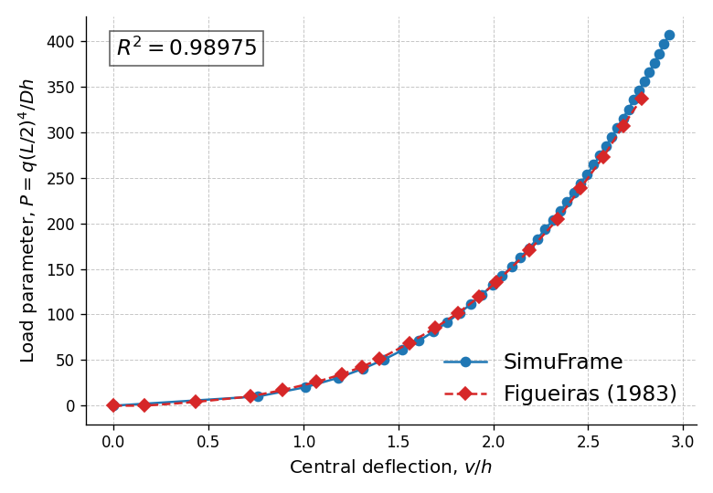
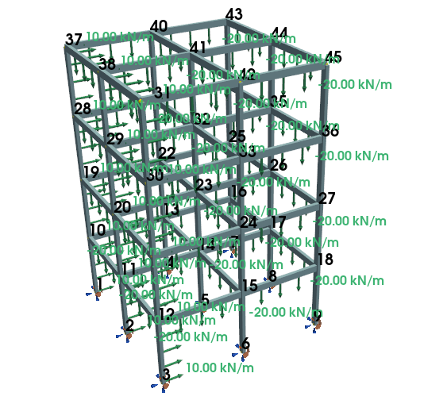

# Summary

`SimuFrame` is a Python-based finite element analysis (FEA) library designed
for the nonlinear analysis of three-dimensional space frames and trusses. Built
upon a Total Lagrangian formulation, it implements both Timoshenko and Euler-Bernoulli
beam theories, making it particularly effective for analyzing thin-walled structures and 
slender frames where second-order effects govern structural behavior, while
maintaining the hypothesis of small strains and moderate rotations [@Zienkiewicz:2013].

Beyond standard linear solutions, `SimuFrame` features robust numerical solvers, 
including Newton-Raphson and Arc-Length methods, thereby enabling the tracking of
complex equilibrium path well into the post-critical regime. `SimuFrame` also includes
a module for eigenvalue analysis for linear buckling prediction, allowing users
to assess structural stability and identify critical load factors. Crucially, `SimuFrame` 
bridges the gap between advanced numerical simulation and accessible visualization tools, 
enabling users to gain deeper insights into structural behavior. It integrates seamlessly
with `PyVista` and `Matplotlib` for post-processing, generating intuitive visualizations
of deformed configurations and internal force distributions, streamlining the interpretation
of complex structural phenomena.

# Statement of need

In civil and structural engineering, accounting for geometric nonlinearity
is essential for the safe and economical design of slender structures, such as
high-rise buildings, space frames, and thin-walled towers. While established
commercial solvers like Ansys, Abaqus, and Dlubal RFEM offer powerful capabilities
for these analyses, they present significant barriers to entry for research
and education. These tools are typically proprietary "black boxes," 
computationally expensive, and require costly licenses that can be prohibitive
for academic institutions and individual researchers. Furthermore, their closed 
architecture lacks the flexibility required for rapid prototyping of new finite 
element formulations or for the transparent exploration of solver algorithms in 
an academic setting.

`SimuFrame` addresses these challenges by providing an open-source, accessible, and
transparent implementation of nonlinear beam theory within the scientific Python
ecosystem. Python enables a balance between development speed and computational 
efficiency, utilizing libraries like `NumPy` and `SciPy` for vectorized matrix 
operations and sparse linear solvers. The API was designed to offer
an intuitive, object-oriented interface that abstracts the complexity of the Finite
Element Method (FEM) while keeping the underlying mechanics—such as the Total Lagrangian
formulation, Green-Lagrange strain vectors, and tangent stiffness matrices—accessible
for inspection and modification.

A critical gap in many open-source FEA codes is the lack of immediate, intuitive
visualization. `SimuFrame` bridges this gap by integrating `PyVista` for interactive
3D rendering and `Matplotlib` for 2D equilibrium path plotting. This seamless integration
allows researchers and engineers to visualize complex phenomena, such as bifurcation
points and post-buckling modes, without needing to export data to external post-processors.

`SimuFrame` is designed to be used by structural engineering researchers requiring a
malleable codebase for algorithm development, as well as by students in graduate courses
on computational mechanics and stability. The software has been rigorously validated 
against industry standards; benchmark tests compare `SimuFrame` against Abaqus and Dlubal
RFEM, yielding displacement results within a 1.5% discrepancy in complex scenarios and
matching theoretical values in canonical stability cases. By democratizing access to robust
nonlinear analysis tools, `SimuFrame` fosters a deeper understanding of structural behavior
and facilitates **reproducible research** in computational engineering.

# Mathematics

`SimuFrame` implements a geometrically nonlinear formulation for three-dimensional space
frames, supporting both Euler-Bernoulli (EBBT) and Timoshenko (TBT) beam theories. The
kinematic description adopts a Total Lagrangian approach, where all static and kinematic
variables are referenced to the initial undeformed configuration.

The displacement field is approximated using shape functions ($\mathbf{N}$). Linear
interpolation is employed for axial ($u$) and torsional ($\theta_x$) displacements.
For transverse displacements ($v, w$) and bending rotations, the software adapts the
interpolation based on the element type: Euler-Bernoulli elements utilize cubic Hermitian
polynomials, while Timoshenko elements employ interdependent shape functions. This latter
approach treats cross-sectional rotation as an independent kinematic variable to account
for transverse shear deformation, mitigating shear locking phenomena.

$$\mathbf{u} = \mathbf{N} \mathbf{d}$$

Where $\mathbf{d}$ is the nodal displacement vector.
To capture geometric nonlinearity, the formulation utilizes the Green-Lagrange strain tensor.
The axial strain $\varepsilon_{xx}$ accounts for the coupling between axial stretching and
bending.  Unlike simplified models, `SimuFrame` retains all quadratic terms of the displacement
derivatives to ensure  a robust representation of second-order effects:

$$\varepsilon_{xx} = \frac{\partial u_0}{\partial x} - y \frac{\partial^2 v}{\partial x^2} + z \frac{\partial^2 w}{\partial x^2} + \frac{1}{2} \left[ \left(\frac{\partial u}{\partial x}\right)^2 + \left(\frac{\partial v}{\partial x}\right)^2 + \left(\frac{\partial w}{\partial x}\right)^2 \right]$$

In the discrete finite element model, the strain-displacement relationship is generalized by
decomposing the strain matrix $\mathbf{B}$ into linear ($\mathbf{B}_0$) and nonlinear ($\mathbf{B}_L$) 
components:

$$\delta \varepsilon = (\mathbf{B}_0 + \mathbf{B}_L) \delta \mathbf{d}$$

The equilibrium equations are solved incrementally. The structural response is governed by the
tangent stiffness matrix $\mathbf{K}_T$, derived from the Principle of Virtual Work (PVT). This
matrix is composed of two parts: the constitutive stiffness matrix ($\mathbf{K}_L$), which includes
large displacement effects, and the geometric stiffness matrix ($\mathbf{K}_\sigma$), which accounts
for the stiffening or softening effects induced by the internal stress state in the deformed configuration:

$$\mathbf{K}_T = \mathbf{K}_L + \mathbf{K}_\sigma = \int_V \mathbf{B}^T \mathbf{D} \mathbf{B} \, dV + \int_V \mathbf{G}^T \boldsymbol{\sigma} \mathbf{G} \, dV$$

Where $\mathbf{D}$ is the constitutive material matrix, $\mathbf{G}$ is the gradient matrix of
displacement derivatives, and $\boldsymbol{\sigma}$ is the stress vector.

# Numerical Examples

To ensure the reliability of `SimuFrame`, the implemented formulations have been rigorously validated
against analytical solutions and established commercial software (Abaqus and Dlubal RFEM).

## Simply Supported Beam

A simply supported planar beam subjected to a uniform distributed load was analyzed to verify the core
geometric nonlinear formulation. The load-deflection equilibrium path obtained with `SimuFrame` showed 
excellent agreement with the reference analytical solution [@Figueiras:1983], confirming the accuracy 
of the model implementation for moderate displacements.

{ width=60% }

## Space Frame Analysis

The capability to handle three-dimensional structures was demonstrated through two distinct cases:

1.  **L-Shaped Frame:** A frame composed of two orthogonal members under a perpendicular point load.
The nonlinear equilibrium path for the translations at the joint node yielded a coefficient of determination
($R^2$) greater than 0.99 when compared to numerical results from Abaqus and RFEM. For rotations, the
correlation was slightly lower ($R^2 \approx 0.91$). This deviation arises because the implemented Total
Lagrangian formulation assumes moderate rotations. In this example, rotations exceeded 0.7 radians, pushing
the limits of this theoretical assumption; nevertheless, the results remain valid for practical design purposes.

{ width=50% }

2.  **Four-Story Building:** A complex multi-story frame designed to assess the buckling analysis module. The
first five critical load factors (eigenvalues) were computed and compared with commercial solvers. `SimuFrame`
matched the RFEM results exactly and remained within a 1.5% deviation from Abaqus solutions.

{ width=50% }

| Buckling Mode | SimuFrame ($\lambda$) | Abaqus ($\lambda$) | RFEM ($\lambda$) | Error vs Abaqus (%) | Error vs RFEM (%) |
| :---: | :---: | :---: | :---: | :---: | :---: |
| 1 | 7.235 | 7.221 | 7.235 | 0.19 | 0.00 |
| 2 | 8.916 | 8.902 | 8.915 | 0.16 | 0.01 |
| 3 | 11.445 | 11.430 | 11.446 | 0.13 | 0.01 |
| 4 | 12.650 | 12.844 | 12.651 | 1.51 | 0.01 |
| 5 | 12.949 | 12.921 | 12.949 | 0.22 | 0.00 |

{ width=50% }

The complete scripts for these examples, including mesh generation and post-processing steps, are available in
the `examples/` directory of the repository.

# Acknowledgements

The authors thank the examination committee for their time and valuable feedback.

# References
